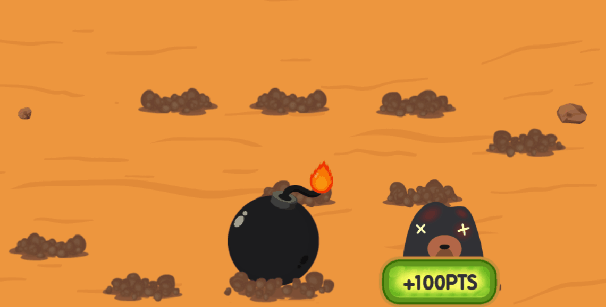

# Auto Player for Whack-A-Mole

This repository contains a Python script that automates the playing of the Whack-A-Mole game on https://plays.org/whack-a-mole/. The script uses computer vision techniques to detect moles that appear on the screen.

## Preview



## Features

- **Automated gameplay**: Detects and clicks on moles using template matching and avoids clicking bombs (even the ones disguised as moles!).
- **Multi-threaded processing**: Enhances performance by processing multiple templates simultaneously.

## Requirements

- OpenCV
- Numpy
- PyAutoGUI
- MSS
- keyboard

## Usage

1. **Run the script**:

    ```bash
    python main.py
    ```

2. **Start the automation**:

    - Press `e` to start the automation.
    - Have the game open in browser and visible on your screen
    - Press `q` to quit the automation.

## Code Explanation

- **Template Matching**: The script uses OpenCV's `matchTemplate` method to find the moles on the screen.
- **Multi-threading**: Each template image is processed in a separate thread to improve performance.
- **Mouse Click Simulation**: PyAutoGUI is used to simulate mouse clicks at the detected mole positions.
